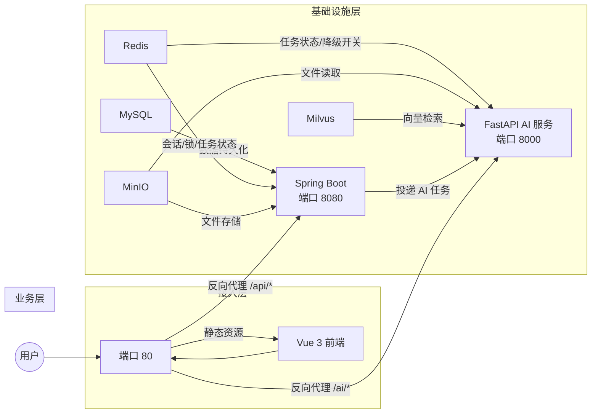

# 双轨制 AI 评分系统 — 开发文档

> **版本**：V3.1（教师管控版 + 本地认证 + Docker 部署）
> **生成日期**：2026-06-22
> **架构**：Spring Boot（主业务） + Redis（状态/并发控制） + Python FastAPI（AI/OCR服务）

---

## 目录

- [1. 前端模块](#1-前端模块)
- [2. 后端主服务模块（Spring Boot）](#2-后端主服务模块spring-boot)
- [3. AI/OCR 算法服务模块（Python FastAPI）](#3-aialgorithm-服务模块python-fastapi)
- [4. 向量数据库模块（Milvus）](#4-向量数据库模块milvus)
- [5. 存储与缓存模块（MinIO / MySQL / Redis）](#5-存储与缓存模块minio--mysql--redis)
- [6. 基础设施与部署](#6-基础设施与部署)
- [7. 依赖版本汇总表](#7-依赖版本汇总表)
- [附录：本地登录认证系统](#附录本地登录认证系统)
- [附录：Docker 一键部署](#附录docker-一键部署)

---

## 1. 前端模块

### 1.1 技术栈

| 依赖 | 版本 | 用途 |
|:---|:---|:---|
| **Vue** | `3.4+` | 核心框架，组合式 API 开发 |
| **Vite** | `5.x` | 构建工具，HMR 开发服务器 |
| **Element Plus** | `2.7+` | UI 组件库（表格、表单、对话框、进度条等） |
| **Pinia** | `2.2+` | 状态管理（用户会话、任务进度、全局配置） |
| **Vue Router** | `4.3+` | 前端路由，教师/学生双角色路由守卫 |
| **Axios** | `1.7+` | HTTP 客户端，统一封装 Token 注入与错误拦截 |
| **v-md-editor** | `2.3+` | Markdown 在线编辑器，教师端评语微调与预览 |
| **pdfjs-dist** | `4.x` | PDF.js 浏览器端渲染，学生端在线预览 AI 评审报告 |
| **TypeScript** | `5.4+` | 类型安全，推荐全量使用 |

### 1.2 功能子模块

#### 1.2.1 认证登录模块
系统支持两种认证方式，前端通过登录页选择：

**方式一：CAS 统一身份认证（学校官方）**
- 拦截学校 CAS 回调地址，提取 `ticket` 参数
- 向后端 `POST /api/auth/cas/callback` 换取自定义 `Access-Token`
- `Access-Token` 存入 `localStorage`，Axios 拦截器自动注入 `Authorization` 请求头

**方式二：本地账号密码登录（本系统独立）**
- 用户通过登录页表单输入用户名和密码
- 向后端 `POST /api/auth/login` 换取自定义 `Access-Token`
- 登录流程复用 CAS 登录的 Token 会话管理机制，后续接口调用完全一致
- 前端登录页提供「CAS 登录」和「本地登录」标签切换
- **密码安全要求**：8-64 位，必须包含大小写字母和数字
- **暴力破解防护**：连续 5 次失败自动锁定账户 30 分钟

**路由守卫**：未登录用户（无 Token）强制跳转登录页

#### 1.2.2 学生提交面板
- 文件上传组件（Element Plus `el-upload`），限制 `.zip` 格式，最大 100MB
- 上传进度条实时显示，断点/失败提示
- 展示三阶段提交状态（`0-已提交待评测` / `2-已完成待发布` / `3-已下发`）
- 已下发状态下展示在线 PDF 预览（`pdfjs-dist`）和下载按钮

#### 1.2.3 教师工作台（核心）
- **全班作业列表**：`el-table` 展示所有学生各阶段提交状态、当前 AI 任务进度
- **一键批量评审**：按钮触发，弹窗确认后发送 `POST /api/eval/trigger`
- **单人评审**：针对特定学生特定阶段触发 AI 评测
- **实时进度轮询**：教师触发后，前端以 `task_id` 轮询 `GET /api/task/status/{task_id}`，渲染多阶段进度条（状态机：10→20→30→40→50）
- **评语微调**：AI 完成后，加载 `v-md-editor`，教师可在线修改 Markdown 评语
- **分数覆盖**：教师输入最终评定分数，覆盖 AI 严格分
- **一键下发**：确认后调用 `POST /api/eval/publish`，状态变更为 `3-已下发`，学生端解锁

#### 1.2.4 PDF 报告导出
- 学生端下载 AI + 教师最终评语的 PDF 报告
- 后端生成 PDF，前端通过 `pdfjs-dist` 在线预览后触发浏览器下载

---

## 2. 后端主服务模块（Spring Boot）

### 2.1 技术栈

| 依赖 | Maven 坐标 / 版本 | 用途 |
|:---|:---|:---|
| **Spring Boot** | `org.springframework.boot:spring-boot-starter-parent:3.2+` | 核心框架 |
| **Spring Security** | `spring-boot-starter-security` | 认证授权、Token 校验、接口权限 |
| **Spring Data Redis** | `spring-boot-starter-data-redis` | Redis 操作（状态机、配额计数器、会话） |
| **Redisson** | `org.redisson:redisson-spring-boot-starter:3.27+` | 分布式强互斥锁（教师端 AI 任务锁） |
| **MyBatis-Plus** | `com.baomidou:mybatis-plus-spring-boot3-starter:3.5+` | ORM，MySQL 增删改查 |
| **MySQL Connector** | `com.mysql:mysql-connector-j:8.0+` | MySQL 8.0 驱动 |
| **MinIO SDK** | `io.minio:minio:8.5+` | 对象存储客户端，文件上传/下载流式操作 |
| **Caffeine** | `com.github.ben-manes.caffeine:caffeine:3.x` | 本地缓存，热点数据二级缓存（可选） |
| **Knife4j** | `com.github.xiaoymin:knife4j-openapi3-spring-boot-starter:4.x` | API 文档（Swagger 增强） |
| **Lombok** | `org.projectlombok:lombok:1.18+` | 减少样板代码 |
| **Java JDK** | `17` | LTS 版本，Spring Boot 3 最低要求 |

### 2.2 功能子模块

#### 2.2.1 认证授权模块 `auth`
| 接口 | 方法 | 路径 | 说明 |
|:---|:---|:---|:---|
| 本地登录 | `POST` | `/api/auth/login` | 用户名+密码登录，支持暴力破解防护 |
| 注册本地用户 | `POST` | `/api/auth/register` | 管理员注册本地用户（关联 student/teacher） |
| 修改密码 | `POST` | `/api/auth/change-password` | 登录用户修改自己的密码 |
| 查询锁定状态 | `GET` | `/api/auth/lock-status` | 查询账户是否被锁定及剩余时间 |
| CAS 回调 | `POST` | `/api/auth/cas/callback` | 接收 `ticket`，验证后生成自定义 Token |
| 登出 | `POST` | `/api/auth/logout` | 清除 Redis 会话，返回 CAS 登出重定向 URL |
| 获取用户信息 | `GET` | `/api/auth/me` | 返回当前用户角色（student/teacher）及基本信息 |

**数据持久化**：
- CAS 登录：学生 9 项字段写入 `t_student` 表，教师 6 项字段写入 `t_teacher` 表（首次 INSERT，后续 UPDATE）
- 本地登录：用户凭证写入 `t_local_user` 表，密码使用 BCrypt（cost=12）加盐哈希，永不明文存储
- `t_local_user.user_no` 逻辑关联 `t_student.student_no` 或 `t_teacher.teacher_no`

#### 2.2.2 文件上传与管理模块 `file`
| 接口 | 方法 | 路径 | 说明 |
|:---|:---|:---|:---|
| 学生上传文件 | `POST` | `/api/file/upload` | 接收 `.zip` + 报告，UUID 混淆路径后写入 MinIO |
| 下载文件 | `GET` | `/api/file/download/{file_id}` | 校验 Redis Token 权限后从 MinIO 流式返回 |
| 获取文件元信息 | `GET` | `/api/file/info/{file_id}` | 返回文件名、大小、上传时间 |

**物理隔离策略**：UUID 混淆物理路径，文件地址写入 `t_submission_stage` 表的 `code_package_path` / `report_path` 字段，向前端隐藏一切真实目录。MinIO 访问策略为 Private，下载时由后端校验 Redis Token 权限后流式中转。

**分布式锁**：
```
Key:  neusoft:lock:student_upload:{student_no}:{course_id}:{stage_num}
策略: tryLock(wait=3s, lease=10s)
目的: 防止学生网络重试导致 MinIO 重复文件 + MySQL 重复记录
```

#### 2.2.3 AI 评测触发与任务管理模块 `eval`
| 接口 | 方法 | 路径 | 说明 |
|:---|:---|:---|:---|
| 触发批量评审 | `POST` | `/api/eval/trigger` | 教师触发全班/单人 AI 评测，投递异步任务给 FastAPI |
| 查询任务状态 | `GET` | `/api/task/status/{task_id}` | 前端轮询，返回 Redis 中任务状态机当前值 |
| 发布评审结果 | `POST` | `/api/eval/publish` | 教师确认下发，状态变更为 `3-已下发` |
| 获取评审报告 | `GET` | `/api/eval/report/{student_no}/{stage}` | 获取 `t_submission_stage` 中的 AI 评语（含教师修改后版本） |

**教师端分布式锁**：
```
Key:  neusoft:lock:teacher_eval:{student_no}:{course_id}:{stage_num}
策略: tryLock(wait=5s, lease=180s)
目的: 防止同组教师或重复点击触发同一条 AI 任务
```

**配额控制**：
```
Key:  neusoft:quota:deepseek:date:{yyyyMMdd}
类型: Redis INCR 计数器，与购买的企业配额上限对比
降级: 配额耗尽时写入 neusoft:config:model_fallback = "local"
```

#### 2.2.4 评语微调与分数管理模块 `review`
| 接口 | 方法 | 路径 | 说明 |
|:---|:---|:---|:---|
| 保存教师修改评语 | `PUT` | `/api/review/comment` | 教师在线编辑 Markdown 评语后保存（直接覆盖 `t_submission_stage.final_report_markdown`） |
| 保存最终分数 | `PUT` | `/api/review/score` | 教师输入最终分数，覆盖 AI 分数（直接覆盖 `t_submission_stage.teacher_score`） |

> **注意**：当前 SQL 设计中教师每次修改直接覆盖原值，不保留历史版本。若未来需要修改历史追溯，可在 `t_submission_stage` 基础上增加 `t_review_history` 扩展表。

#### 2.2.5 用户与课程管理模块 `user`
| 接口 | 方法 | 路径 | 说明 |
|:---|:---|:---|:---|
| 获取课程学生列表 | `GET` | `/api/user/students/{course_id}` | 教师查看课程下所有学生（JOIN `t_student_course` + `t_student`） |
| 获取学生三阶段状态 | `GET` | `/api/user/progress/{student_no}/{course_id}` | 查询三阶段提交与评审状态（查询 `t_submission_stage`） |
| 获取期末总分 | `GET` | `/api/user/final-score/{student_no}/{course_id}` | 查询期末总分与总评语（查询 `t_student_course`） |

### 2.3 Redis Key 设计总览

| Key 模式 | 类型 | TTL | 说明 |
|:---|:---|:---|:---|
| `neusoft:lock:student_upload:{student}:{course}:{stage}` | String (分布式锁) | 10s | 学生上传幂等锁 |
| `neusoft:lock:teacher_eval:{student}:{course}:{stage}` | String (Redisson 锁) | 180s | 教师 AI 触发强互斥锁 |
| `neusoft:quota:deepseek:date:{yyyyMMdd}` | String (INCR) | 24h | 每日 DeepSeek 调用配额 |
| `neusoft:config:model_fallback` | String | 手动清除 | 模型降级开关，`"local"` 触发 Ollama |
| `neusoft:task:status:{task_id}` | Hash | 24h | 异步 AI 任务状态机 |
| `session:user:{token_hash}` | Hash | 2h | 用户会话缓存 |

### 2.4 任务状态机设计

```
10 (等待队列中)
  ↓
20 (PaddleOCR 图文解析中)
  ↓
30 (Milvus 评分标准检索中)
  ↓
40 (DeepSeek 深度分析中)
  ↓
50 (完成)
```

异常状态：`-1 (失败)`，附带错误信息字段 `error_msg`。

**Redis 任务状态 → MySQL 业务状态 映射关系**：

| Redis 任务状态 | MySQL `status` | 说明 |
|:---|:---|:---|
| `10` / `20` / `30` / `40` | `1`（AI 评测中） | AI 运行期间，MySQL 维持 `1` 不变 |
| `50` | `2`（待发布） | AI 完成后，FastAPI 同时更新 Redis=50 和 MySQL=2 |
| `-1` | `0`（回退）或保持 `1` | 失败时 MySQL 状态由业务逻辑决定是否回退 |

---

## 3. AI/OCR 算法服务模块（Python FastAPI）

### 3.1 技术栈

| 依赖 | PyPI 包 / 版本 | 用途 |
|:---|:---|:---|
| **FastAPI** | `fastapi==0.111+` | 异步 Web 框架，接收 Java 端投递的评测任务 |
| **Uvicorn** | `uvicorn[standard]==0.29+` | ASGI 服务器 |
| **LangChain** | `langchain==0.2+` | LLM 调用编排，Prompt 模板管理 |
| **LlamaIndex** | `llama-index==0.10+` | RAG 管道，文档切片与检索增强生成（可选，与 LangChain 二选一） |
| **DeepSeek SDK** | `openai==1.30+` | 通过 OpenAI 兼容接口调用 DeepSeek API |
| **Ollama Python** | `ollama==0.2+` | 本地私有化模型调用（降级方案） |
| **PaddleOCR** | `paddleocr==2.8+` / `paddlepaddle==2.6+` | OCR 图文识别，提取报告截图中的文字代码 |
| **pymilvus** | `pymilvus==2.4+` | Milvus 向量数据库客户端，RAG 评分标准检索 |
| **sentence-transformers** | `sentence-transformers==2.7+` | 加载 `bge-large-zh-v1.5` 本地 Embedding 模型 |
| **Redis** | `redis[hiredis]==5.0+` | 读取降级开关、更新任务状态机 |
| **pymysql** | `pymysql==1.1+` | 联合评审时查询上一轮教师终审评语 |
| **python-docx** | `python-docx==1.1+` | 解析学生报告 `.docx`，提取正文段落及嵌入图片 |
| **zipfile36** | 内置 `zipfile` | 解压学生提交的 `.zip` 代码包 |
| **Python** | `3.10+` | PaddleOCR / LangChain 最低要求 |

### 3.2 功能子模块

#### 3.2.1 任务接收与调度接口

| 接口 | 方法 | 路径 | 说明 |
|:---|:---|:---|:---|
| 接收评测任务 | `POST` | `/ai/eval/submit` | 接收 `{task_id, student_no, course_id, stage}`，异步执行评测流程 |
| 健康检查 | `GET` | `/ai/health` | Java 端心跳探针，检测 FastAPI 服务存活 |

任务接收后立即返回 `task_id`，后台异步执行，通过 Redis 更新状态机（10→20→30→40→50）。

#### 3.2.2 OCR 图文解析子模块

**输入**：MinIO 中学生上传的 `.zip` 文件
**处理流程**：
1. 解压 `.zip` 到临时目录，定位报告 Word 文档（`.docx`）
2. 使用 `python-docx` 解析 `.docx`，提取正文段落文本；同时遍历文档中嵌入的图片（实验截图、控制台截图、流程图等）
3. 将提取出的嵌入图片逐张调用 `PaddleOCR` 识别文字内容（如截图中的代码、运行结果、配置参数等）
4. 识别结果按图片在文档中的出现顺序，**原位插入**到对应段落位置，拼接成完整的结构化报告文本
5. 输出结构化文本，交给下游 RAG + LLM

> **关键点**：OCR 的目标不是单独的图片文件，而是 Word 报告文档中嵌入的截图——学生将实验过程截图粘贴到报告中，这些截图包含关键的代码和运行结果，必须通过 OCR 提取后才能被 LLM 理解和评分。

**状态更新**：进入时 Redis 状态 → `20`，完成后 → `30`

#### 3.2.3 RAG 评分标准检索子模块

**处理流程**：
1. 根据 `course_id` 和 `stage` 查询 Milvus `grading_standards` 集合
2. 将学生报告文本 Embedding（`bge-large-zh-v1.5`，1024 维）
3. 在 Milvus 中执行向量相似度检索，取 Top-K 相关评分标准切片
4. 拼接为 System Prompt 的上下文

**Embedding 模型**：
```
模型: BAAI/bge-large-zh-v1.5
维度: 1024
加载方式: sentence-transformers 本地加载，GPU 加速（如有）
```

**状态更新**：进入时 → `30`，完成后 → `40`

#### 3.2.4 LLM 深度分析子模块

**模型路由逻辑**（降级自适应）：
```python
# 伪代码
fallback = redis.get("neusoft:config:model_fallback")
if fallback == "local":
    llm = Ollama(model="deepseek-r1-distill-qwen-14b")
else:
    llm = DeepSeekAPI(api_key=..., model="deepseek-chat")
```

**联合评审上下文**（教师开启 `is_joint_review=1` 时）：
- 从 MySQL `t_submission_stage` 查询该学生**上一阶段** (`stage_num - 1`) 被教师**最终锁定**的 `teacher_score`、`final_report_markdown`（状态必须为 `3-已下发`）
- 拼接到 System Prompt，要求 LLM 审查本次提交是否有"实质性工作增量"

**输出**：
- AI 严格分（0-100）
- Markdown 格式评审报告

**状态更新**：进入时 → `40`，完成后写入 MySQL，Redis 状态 → `50`

#### 3.2.5 结果持久化

- AI 分数写入 `t_submission_stage.ai_score`，Markdown 报告写入 `ai_report_markdown` 字段
- `model_used` 字段记录本次实际使用的模型（`DeepSeek-R1` / `Ollama-Local`），用于监控降级切换
- `status` 更新为 `2-AI评测完成（待发布）`，此时学生端完全屏蔽
- 教师端轮询 Redis 检测到 `50` 后，从 `t_submission_stage` 加载报告到 `v-md-editor`

---

## 4. 向量数据库模块（Milvus）

### 4.1 环境

| 依赖 | 版本 | 说明 |
|:---|:---|:---|
| **Milvus** | `2.4+`（推荐 `2.4.1` LTS） | 向量数据库，支持标量索引 + 向量检索混合查询 |
| **Milvus SDK (Java)** | `io.milvus:milvus-sdk-java:2.4+` | Java 端管理集合、上传评分标准文档 |
| **pymilvus (Python)** | `pymilvus==2.4+` | Python 端向量检索 |

### 4.2 集合设计：`grading_standards`

| 字段 | 类型 | 约束 | 说明 |
|:---|:---|:---|:---|
| `chunk_id` | `INT64` | 主键，自动递增 | 唯一切片 ID |
| `vector` | `FLOAT_VECTOR(1024)` | — | `bge-large-zh-v1.5` 生成的密集向量 |
| `course_id` | `VARCHAR(32)` | 标量索引 | 课程 ID，多租户数据隔离 |
| `teacher_id` | `VARCHAR(32)` | — | 上传评分标准的教师工号 |
| `stage` | `INT32` | 标量索引 | `0` 通用 / `1` 阶段一 / `2` 阶段二 / `3` 阶段三 |
| `content` | `VARCHAR(4000)` | — | 原始评分规则文本明文 |

**索引策略**：
- 向量字段：`HNSW` 索引（`M=16, efConstruction=200`），余弦相似度
- 标量字段：`course_id` + `stage` 联合标量索引，支持多课程并发检索隔离

### 4.3 评分标准上传接口（教师端）

| 接口 | 方法 | 路径 | 说明 |
|:---|:---|:---|:---|
| 上传评分标准文档 | `POST` | `/api/standard/upload` | 教师上传 `.docx` / `.pdf` / `.txt`，后端切片 + Embedding 写入 Milvus |
| 查询已上传标准 | `GET` | `/api/standard/list/{course_id}` | 查看课程下已入库的评分标准切片数 |

---

## 5. 存储与缓存模块（MinIO / MySQL / Redis）

### 5.1 MinIO 对象存储

| 配置项 | 推荐值 | 说明 |
|:---|:---|:---|
| **版本** | `RELEASE.2024-05-10T01-41-38Z` 或更新 | 私有化本地部署 |
| **Bucket 命名** | `neusoft-submissions` | 学生提交文件桶 |
| **访问策略** | 私有（Private），后端流式中转 | 前端无法直接访问 MinIO URL |
| **存储路径** | `{course_id}/{student_no}/{stage}/{uuid}.zip` | UUID 混淆文件名 |

### 5.2 MySQL 数据库设计

**版本**：MySQL `8.0+`，字符集 `utf8mb4`，排序规则 `utf8mb4_general_ci`

**数据库名**：`neusoft_ai_grading`

**DDL 初始化脚本**：[`docs/database_schema_v3.sql`](database_schema_v3.sql)

#### 表结构总览

本系统共 5 张核心业务表，设计原则为"角色拆表、提交-评审合一"：

| 表名 | 说明 |
|:---|:---|
| `t_student` | 学生信息表（CAS 9 字段缓存） |
| `t_teacher` | 教师信息表（CAS 6 字段缓存） |
| `t_course_project` | 课程项目主表（含三阶段权重配置） |
| `t_student_course` | 学生选课与期末总分结算表 |
| `t_submission_stage` | **核心业务主表**：三阶段提交 + AI/教师双轨评审 |

#### 表一：`t_student` — 学生信息表

> 首次通过 CAS 登录时自动持久化，后续登录同步更新。

| 字段 | 类型 | 约束 | 说明 |
|:---|:---|:---|:---|
| `student_no` | `VARCHAR(32)` | 主键 | 学号 |
| `name` | `VARCHAR(50)` | NOT NULL | 姓名 |
| `gender` | `VARCHAR(10)` | — | 性别 |
| `dept_code` | `VARCHAR(32)` | — | 院(系)/部代码 |
| `dept_name` | `VARCHAR(100)` | — | 院(系)/部名称 |
| `major_code` | `VARCHAR(32)` | — | 专业代码 |
| `major_name` | `VARCHAR(100)` | — | 专业名称 |
| `class_code` | `VARCHAR(32)` | 索引 `idx_class_code` | 班级代码 |
| `class_name` | `VARCHAR(100)` | — | 班级名称 |
| `create_time` | `DATETIME` | DEFAULT CURRENT_TIMESTAMP | 首次 CAS 登录录入时间 |

#### 表二：`t_teacher` — 教师信息表

> 首次通过 CAS 登录时自动持久化。

| 字段 | 类型 | 约束 | 说明 |
|:---|:---|:---|:---|
| `teacher_no` | `VARCHAR(32)` | 主键 | 教师工号 |
| `teacher_name` | `VARCHAR(50)` | NOT NULL | 教师姓名 |
| `dept_code` | `VARCHAR(32)` | — | 院(系)/部代码 |
| `dept_name` | `VARCHAR(100)` | — | 院(系)/部名称 |
| `title_code` | `VARCHAR(32)` | — | 职称代码 |
| `title_name` | `VARCHAR(100)` | — | 职称名称 |
| `create_time` | `DATETIME` | DEFAULT CURRENT_TIMESTAMP | 首次 CAS 登录录入时间 |

#### 表三：`t_course_project` — 课程项目主表

> 教师创建课程项目时写入，含三阶段权重配置和评分标准文档路径。

| 字段 | 类型 | 约束 | 说明 |
|:---|:---|:---|:---|
| `course_id` | `VARCHAR(32)` | 主键 | 课程项目唯一 UUID |
| `course_name` | `VARCHAR(150)` | NOT NULL | 课程项目名称 |
| `teacher_no` | `VARCHAR(32)` | NOT NULL，索引 `idx_teacher_no` | 负责教师工号 |
| `semester` | `VARCHAR(50)` | — | 开课学期（如 `2025-2026-1`） |
| `standard_doc_url` | `VARCHAR(500)` | — | 评分标准文档在 MinIO 中的物理路径 |
| `weight_stage1` | `DECIMAL(4,2)` | DEFAULT 0.20 | 阶段 1 分数权重 |
| `weight_stage2` | `DECIMAL(4,2)` | DEFAULT 0.30 | 阶段 2 分数权重 |
| `weight_stage3` | `DECIMAL(4,2)` | DEFAULT 0.50 | 阶段 3 分数权重 |
| `create_time` | `DATETIME` | DEFAULT CURRENT_TIMESTAMP | 课程创建时间 |

#### 表四：`t_student_course` — 学生选课与期末结算表

> 记录学生与课程的绑定关系，期末总分可由三阶段加权自动计算，也可由教师直接覆盖。

| 字段 | 类型 | 约束 | 说明 |
|:---|:---|:---|:---|
| `id` | `BIGINT` | 主键，自增 | — |
| `student_no` | `VARCHAR(32)` | NOT NULL | 学号 |
| `course_id` | `VARCHAR(32)` | NOT NULL | 课程项目 ID |
| `final_score` | `DECIMAL(5,2)` | — | 期末总分（加权计算或教师覆盖） |
| `teacher_final_comment` | `TEXT` | — | 教师期末总评语 |
| `grade_status` | `TINYINT` | DEFAULT 0 | `0`-未生成 / `1`-已下发学生可见 |
| `update_time` | `DATETIME` | ON UPDATE CURRENT_TIMESTAMP | 最后修改时间 |

**唯一索引**：`uk_stu_course` (`student_no`, `course_id`)

#### 表五：`t_submission_stage` — 三阶段提交与双轨评审主表（核心）

> 本表是系统核心业务流转表，融合了文件提交、AI 评测、教师微调、状态机流转全部逻辑。每个学生每门课程每个阶段对应唯一一条记录。
>
> **双层状态设计**：MySQL 中 `status` 字段（0→1→2→3）记录业务终态，Redis 中 `neusoft:task:status:{task_id}`（10→20→30→40→50）记录 AI 评测的实时进度细节。二者独立更新，前端通过轮询 Redis 获取精细进度，教师操作（改分/下发）更新 MySQL 状态。

| 字段 | 类型 | 约束 | 说明 |
|:---|:---|:---|:---|
| `submission_id` | `BIGINT` | 主键，自增 | — |
| `student_no` | `VARCHAR(32)` | NOT NULL | 学号 |
| `course_id` | `VARCHAR(32)` | NOT NULL | 课程项目 ID |
| `stage_num` | `TINYINT` | NOT NULL | 阶段编号：`1`/`2`/`3` |
| `code_package_path` | `VARCHAR(500)` | NOT NULL | 代码压缩包 MinIO 混淆路径 |
| `report_path` | `VARCHAR(500)` | NOT NULL | 图文报告 MinIO 混淆路径 |
| `is_joint_review` | `TINYINT` | DEFAULT 0 | 是否联合评审：`0`-不联合 / `1`-联合（引入上一轮教师终审评语） |
| `model_used` | `VARCHAR(50)` | DEFAULT `'DeepSeek-R1'` | 实际执行的模型名称（监控降级切换） |
| `ai_score` | `DECIMAL(5,2)` | — | AI 严格初始分数 |
| `ai_report_markdown` | `LONGTEXT` | — | AI 原始 Markdown 评审报告 |
| `teacher_score` | `DECIMAL(5,2)` | — | 教师微调后的最终阶段分数 |
| `final_report_markdown` | `LONGTEXT` | — | 教师修改后的最终 Markdown 报告 |
| `status` | `TINYINT` | NOT NULL，DEFAULT 0 | **核心状态机**（见下方说明） |
| `submit_time` | `DATETIME` | DEFAULT CURRENT_TIMESTAMP | 学生提交时间 |
| `eval_trigger_time` | `DATETIME` | — | 教师触发 AI 评测时间 |
| `review_time` | `DATETIME` | — | 教师下发时间 |

**唯一索引**：`uk_stu_course_stage` (`student_no`, `course_id`, `stage_num`)
**普通索引**：`idx_course_stage` (`course_id`, `stage_num`)

**状态机说明**：

| 状态值 | 含义 | 可见范围 |
|:---|:---|:---|
| `0` | 已提交待评测（学生刚传完文件） | 仅学生自己可见"已提交" |
| `1` | AI 评测中（教师已触发异步任务） | 教师可见进度 |
| `2` | AI 评测完成 / 待发布 | 教师可预览、改分、改报告；学生不可见 |
| `3` | 已下发 | 学生端解锁，可在线预览并导出 PDF |

#### 表关系 ER 图

```
t_student (PK: student_no)
    │
    ├──< t_student_course (UK: student_no + course_id)
    │         │
    │         └── references t_course_project (PK: course_id)
    │                          │
    │                          └── references t_teacher (PK: teacher_no)
    │
    └──< t_submission_stage (UK: student_no + course_id + stage_num)
              │
              └── 逻辑外键: course_id → t_course_project.course_id
```

> **设计说明**：表间通过业务字段（`student_no`、`course_id`）建立逻辑关联，不使用物理外键约束，以保证写入性能和灵活性。

### 5.3 Redis 依赖

| 组件 | 版本 | 说明 |
|:---|:---|:---|
| **Redis Server** | `7.x`（推荐 `7.2+`） | 状态流转、分布式锁、配额计数、会话管理 |
| **Redisson (Java)** | `3.27+` | 强互斥锁实现（教师端 AI 触发锁） |
| **redis-py (Python)** | `5.0+` | FastAPI 端读取降级开关、更新任务状态 |

---

## 6. 基础设施与部署

### 6.1 推荐部署架构

| 服务 | 实例数 | 说明 |
|:---|:---|:---|
| Vue 前端（Nginx 托管） | 1 | 静态资源，Nginx 反向代理后端 API |
| Spring Boot 主服务 | 1-2 | 核心业务，水平扩展需配 Redis 会话 |
| FastAPI 算法服务 | 1-2 | AI/OCR，GPU 实例推荐（PaddleOCR 加速） |
| MySQL 8.0 | 1（主） | 单机即可，教学场景并发有限 |
| Redis 7.x | 1 | 单机，AOF 持久化，重启不丢任务状态 |
| Milvus 2.4 | 1（standalone） | 教学场景 standalone 模式足够 |
| MinIO | 1 | 本地私有化部署，单节点即可 |
| Ollama | 1（GPU 推荐） | 本地私有化降级模型，显存需求 ≥16GB（14B 模型） |

### 6.2 Docker 一键部署（当前推荐方案）

完整的 `docker-compose.yml` 位于项目根目录，实现"一条命令启动全部服务"。

#### 快速启动

```bash
# 1. 克隆项目
git clone <repo-url> && cd grading_knowledge

# 2. 配置环境变量（修改 DeepSeek API Key 等）
cp .env.example .env

# 3. 一键启动所有服务
docker compose up -d

# 4. 访问系统
#    前端页面:     http://localhost
#    API 文档:     http://localhost/doc.html
#    MinIO 控制台: http://localhost:9001
```

#### 服务架构



#### 服务列表

| 容器名 | 镜像 | 端口映射 | 健康检查 |
|:---|:---|:---|:---|
| `grading-mysql` | mysql:8.0 | 3306 | mysqladmin ping |
| `grading-redis` | redis:7.2-alpine | 6379 | redis-cli ping |
| `grading-minio` | minio/minio | 9000(API)/9001(控制台) | mc ready |
| `grading-milvus` | milvusdb/milvus:v2.4.1 | 19530 | /healthz |
| `grading-backend` | 本地构建 | 8080 | Spring Boot Actuator |
| `grading-ai-service` | 本地构建 | 8000 | FastAPI /ai/health |
| `grading-frontend` | 本地构建 | 80 (Nginx) | Nginx 默认 |

#### 数据持久化

| 数据卷 | 挂载服务 | 存储内容 |
|:---|:---|:---|
| `mysql-data` | MySQL | 数据库文件 |
| `redis-data` | Redis | AOF 持久化文件 |
| `minio-data` | MinIO | 学生提交文件 |
| `milvus-data` | Milvus | 向量索引数据 |

#### 环境变量说明（.env 文件）

```bash
# MySQL 密码
MYSQL_ROOT_PASSWORD=NeusoftGrading@2026

# DeepSeek API（必须配置，否则 AI 判分不可用）
DEEPSEEK_API_KEY=your_deepseek_api_key_here

# MinIO
MINIO_ROOT_USER=minioadmin
MINIO_ROOT_PASSWORD=minioadmin@2026
```

#### 管理命令

```bash
# 查看运行状态
docker compose ps

# 查看日志（按服务筛选）
docker compose logs -f backend
docker compose logs -f ai-service

# 重启单个服务
docker compose restart backend

# 停止所有服务（保留数据卷）
docker compose down

# 停止并清理数据（慎用：删除所有数据卷）
docker compose down -v

# 重新构建镜像
docker compose build --no-cache backend
```

---

## 7. 依赖版本汇总表

### 前端

| 包名 | 版本 | npm/yarn 命令 |
|:---|:---|:---|
| vue | `^3.4` | `npm install vue@^3.4` |
| vite | `^5.0` | `npm install -D vite@^5.0` |
| element-plus | `^2.7` | `npm install element-plus@^2.7` |
| pinia | `^2.2` | `npm install pinia@^2.2` |
| vue-router | `^4.3` | `npm install vue-router@^4.3` |
| axios | `^1.7` | `npm install axios@^1.7` |
| v-md-editor | `^2.3` | `npm install @kangc/v-md-editor@^2.3` |
| pdfjs-dist | `^4.0` | `npm install pdfjs-dist@^4.0` |
| typescript | `^5.4` | `npm install -D typescript@^5.4` |

### 后端（Java / Spring Boot）

| 坐标 | 版本 | 说明 |
|:---|:---|:---|
| `spring-boot-starter-parent` | `3.2.x` | 父 POM |
| `spring-boot-starter-web` | 随父 POM | REST API |
| `spring-boot-starter-security` | 随父 POM | 认证授权 |
| `spring-boot-starter-data-redis` | 随父 POM | Redis 操作 |
| `org.redisson:redisson-spring-boot-starter` | `3.27.x` | 分布式锁 |
| `com.baomidou:mybatis-plus-spring-boot3-starter` | `3.5.x` | ORM |
| `com.mysql:mysql-connector-j` | `8.0.x` | MySQL 驱动 |
| `io.minio:minio` | `8.5.x` | MinIO 客户端 |
| `com.github.xiaoymin:knife4j-openapi3-spring-boot-starter` | `4.x` | API 文档 |
| `org.projectlombok:lombok` | `1.18.x` | 工具 |

### AI 服务（Python）

| 包名 | 版本 | pip 命令 |
|:---|:---|:---|
| fastapi | `0.111+` | `pip install fastapi==0.111.*` |
| uvicorn[standard] | `0.29+` | `pip install "uvicorn[standard]==0.29.*"` |
| langchain | `0.2+` | `pip install langchain==0.2.*` |
| openai | `1.30+` | `pip install openai==1.30.*`（DeepSeek 兼容） |
| ollama | `0.2+` | `pip install ollama==0.2.*` |
| paddleocr | `2.8+` | `pip install paddleocr==2.8.*` |
| paddlepaddle | `2.6+` | `pip install paddlepaddle==2.6.*`（GPU 版：`paddlepaddle-gpu`） |
| pymilvus | `2.4+` | `pip install pymilvus==2.4.*` |
| sentence-transformers | `2.7+` | `pip install sentence-transformers==2.7.*` |
| redis | `5.0+` | `pip install "redis[hiredis]==5.0.*"` |
| pymysql | `1.1+` | `pip install pymysql==1.1.*` |
| python-docx | `1.1+` | `pip install python-docx==1.1.*` |

### 基础设施

| 组件 | 版本 | 部署方式 |
|:---|:---|:---|
| MySQL | `8.0+` | Docker / 物理机 |
| Redis | `7.2+` | Docker，AOF 持久化 |
| MinIO | `RELEASE.2024-05+` | Docker，本地私有化 |
| Milvus | `2.4.1+` (standalone) | Docker Compose |
| Ollama | `最新稳定版` | Docker / 物理机（需 GPU） |
| Nginx | `1.25+` | 前端静态资源托管 + 反向代理 |

---

## 附录：本地登录认证系统

### 设计目标

在与学校 CAS 统一身份认证并行的前提下，为本系统提供独立的用户名密码登录方式，
满足以下场景：
- 校外用户或合作院校教师无需 CAS 账号即可使用系统
- 系统管理员独立管理，不依赖学校统一身份认证
- CAS 服务不可用时的应急登录通道

### 安全设计

| 安全措施 | 实现方式 |
|:---|:---|
| 密码存储 | BCrypt 加盐哈希（cost factor = 12），永不明文留存 |
| 暴力破解防护 | Redis 记录连续失败次数 ≥ 5 次，锁定账户 30 分钟 |
| 账户禁用 | 管理员可手动锁定账户（status=1），彻底禁止登录 |
| 密码强度 | 8-64 位，必须包含大小写字母和数字 |
| 防枚举攻击 | 不存在的用户名也记录失败计数，返回统一错误信息 |
| 登录传输 | 强制 HTTPS（生产环境） |

### 数据库表 `t_local_user`

```sql
CREATE TABLE `t_local_user` (
  `id` bigint NOT NULL AUTO_INCREMENT COMMENT '自增主键',
  `username` varchar(32) NOT NULL COMMENT '登录用户名（全局唯一）',
  `password_hash` varchar(100) NOT NULL COMMENT 'BCrypt哈希后的密码',
  `role` varchar(16) NOT NULL COMMENT '角色: student/teacher/admin',
  `user_no` varchar(32) DEFAULT NULL COMMENT '关联用户编号',
  `status` tinyint NOT NULL DEFAULT '0' COMMENT '账户状态: 0-正常, 1-锁定',
  `login_fail_count` int NOT NULL DEFAULT '0' COMMENT '连续登录失败次数',
  `locked_until` datetime DEFAULT NULL COMMENT '账户锁定截止时间',
  `create_time` datetime DEFAULT CURRENT_TIMESTAMP,
  `update_time` datetime DEFAULT CURRENT_TIMESTAMP ON UPDATE CURRENT_TIMESTAMP,
  `last_login_time` datetime DEFAULT NULL,
  PRIMARY KEY (`id`),
  UNIQUE KEY `uk_username` (`username`)
) ENGINE=InnoDB DEFAULT CHARSET=utf8mb4 COMMENT='本地登录用户表';
```

### 接口说明

| 端点 | 方法 | 认证要求 | 说明 |
|:---|:---|:---|:---|
| `/api/auth/login` | POST | 无（公开） | 用户名+密码登录，返回 Token |
| `/api/auth/register` | POST | 需管理员 Token | 注册本地用户 |
| `/api/auth/change-password` | POST | 需登录 Token | 修改当前用户密码 |
| `/api/auth/lock-status` | GET | 无（公开） | 查询账户锁定剩余秒数 |

### 核心源码架构

```
backend/src/main/java/com/neusoft/grading/
  ├── entity/LocalUser.java          # 实体类（MyBatis-Plus）
  ├── mapper/LocalUserMapper.java    # 数据访问层
  ├── dto/
  │   ├── LocalLoginRequest.java     # 登录请求 DTO
  │   ├── LocalRegisterRequest.java  # 注册请求 DTO
  │   └── ChangePasswordRequest.java # 改密请求 DTO
  ├── config/PasswordConfig.java     # BCrypt PasswordEncoder Bean
  ├── service/LocalAuthService.java  # 业务接口
  └── service/impl/LocalAuthServiceImpl.java  # 业务实现（含暴力破解防护）
```

### 错误码

| HTTP 状态码 | code | message |
|:---|:---|:---|
| 401 | 401 | 用户名或密码错误 |
| 401 | 401 | 账户已锁定，请 N 分钟后再试 |
| 401 | 401 | 账户已被管理员禁用 |
| 400 | 400 | 用户名已存在 |
| 400 | 400 | 原密码错误 |

### 批量导入学生（Excel）

教师可通过上传 Excel 文件批量创建学生信息和本地登录账号。

**流程：**
1. 教师登录系统 → 进入学生管理 → 上传 Excel
2. 按模板格式填写学生信息（学号、姓名、专业、初始密码等）
3. 上传完成后，系统自动创建 `t_student` 和 `t_local_user` 记录
4. 学生使用**学号**作为用户名，使用导入时设置的密码登录

**登录双模式支持：**

本地登录接口 `/api/auth/login` 同时支持两种方式：
- **用户名登录**：使用 `t_local_user.username` 匹配
- **学号登录**：当用户名匹配失败时，自动通过 `t_local_user.user_no` 与角色(student) 查找

**Excel 模板格式：**

| 学号 | 姓名 | 性别 | 院系代码 | 院系名称 | 专业代码 | 专业名称 | 班级代码 | 班级名称 | 初始密码 |
|:---|:---|:---|:---|:---|:---|:---|:---|:---|:---|

> 初始密码列可选，留空则使用请求参数中的 `defaultPassword`（默认 Neusoft@2026）

**接口：** `POST /api/student/batch-import`（需教师 Token）

**核心源码：**
- `service/impl/LocalAuthServiceImpl.batchImportStudents()` — Excel 解析 + 批量创建
- `dto/BatchImportResult.java` — 导入结果
- `dto/StudentBatchImportRequest.java` — 请求参数

---

## 附录：Docker 一键部署

### 前置条件

- Docker Engine ≥ 24.x
- Docker Compose Plugin（`docker compose` 命令）
- 至少 8GB 可用内存（推荐 16GB）
- 至少 20GB 可用磁盘空间

### 目录结构

```
grading_knowledge/
├── docker-compose.yml        # 主编排文件
├── .env.example              # 环境变量模板（cp 后编辑）
├── deploy/
│   └── nginx.conf            # Nginx 反向代理配置
├── backend/
│   └── Dockerfile            # Spring Boot 多阶段构建
├── ai_service/
│   └── Dockerfile            # Python FastAPI 镜像
├── frontend/
│   └── Dockerfile            # Vue 3 构建 + Nginx 托管
└── docs/
    └── database_schema_v3.sql # 自动初始化脚本
```

### Docker Compose 服务拓扑

```
┌─────────────┐      ┌──────────────┐      ┌──────────────┐
│   minio:9000 │      │   redis:6379 │      │  milvus:19530│
└─────────────┘      └──────────────┘      └──────────────┘
        ↑                      ↑                      ↑
        │                      │                      │
┌───────┴──────────────────────┴──────────────────────┴───────┐
│                     grading-net (bridge)                      │
├─────────────┐  ┌──────────────┐  ┌──────────────────────────┤
│ mysql:3306  │  │  backend:8080│  │  ai-service:8000          │
│ (init-db)   │  │  Spring Boot │  │  FastAPI + PaddleOCR      │
└─────────────┘  └──────┬───────┘  └────────────────┬─────────┘
                         │                           │
                ┌────────┴──────────┐                │
                │   frontend:80     │────────────────┘
                │  Nginx 反向代理    │
                └────────┬──────────┘
                         │
                    ┌────┴────┐
                    │  用户    │
                    └─────────┘
```

### 构建与启动

```bash
# 1. 生成后端 jar 包（首次需要）
cd backend && mvn package -DskipTests && cd ..

# 2. 配置环境变量
cp .env.example .env
# 编辑 .env 填入 DEEPSEEK_API_KEY

# 3. 构建并启动
docker compose up -d --build

# 4. 等待所有服务就绪（约 30-60 秒）
docker compose ps

# 首次启动后，数据库会自动初始化（docs/database_schema_v3.sql）
# 默认管理员账户：admin / Admin@123
```

### 查看日志

```bash
# 实时跟踪所有服务
docker compose logs -f

# 只看后端
docker compose logs -f backend

# 只看 AI 服务
docker compose logs -f ai-service
```

### 停止与清理

```bash
# 正常停止（数据不丢失）
docker compose down

# 完全清理（删除所有数据）
docker compose down -v
rm -rf backend/target
```

### 生产环境注意事项

- 修改 `application.yml` 中 `cas.mock` 为 `false`，配置真实 CAS 地址
- 在 `.env` 中设置强密码（MYSQL_ROOT_PASSWORD、MINIO_ROOT_PASSWORD）
- 使用外部 HTTPS 反向代理（如 Nginx/Caddy）终止 TLS
- AI 服务建议部署在 GPU 节点，启用 PaddleOCR GPU 版本
- Milvus 生产环境建议使用独立 etcd 和存储
- 定期备份 `mysql-data` 和 `minio-data` 数据卷

---

## 附录：技术选型决策记录

| 决策点 | 选型 | 原因 |
|:---|:---|:---|
| LLM 优先 | DeepSeek 云端 | 学校已购企业配额，性价比高 |
| LLM 降级 | Ollama + DeepSeek-R1-Distill-Qwen-14B | 配额耗尽时保障批阅不间断，14B 在教学评分场景精度可接受 |
| OCR | PaddleOCR | 百度开源，中文识别精度最优，支持 GPU 加速 |
| Embedding | bge-large-zh-v1.5 | 中文向量化 SOTA 模型，1024 维，BAAI 开源 |
| 向量库 | Milvus（推荐）/ Qdrant | Milvus 社区活跃，标量+向量混合查询支持完善，适合多租户隔离 |
| 分布式锁 | Redisson | Spring 生态原生支持，API 简洁，watch dog 自动续期 |
| Markdown 编辑 | v-md-editor | Vue 3 原生支持，轻量，满足教师评语微调场景 |
